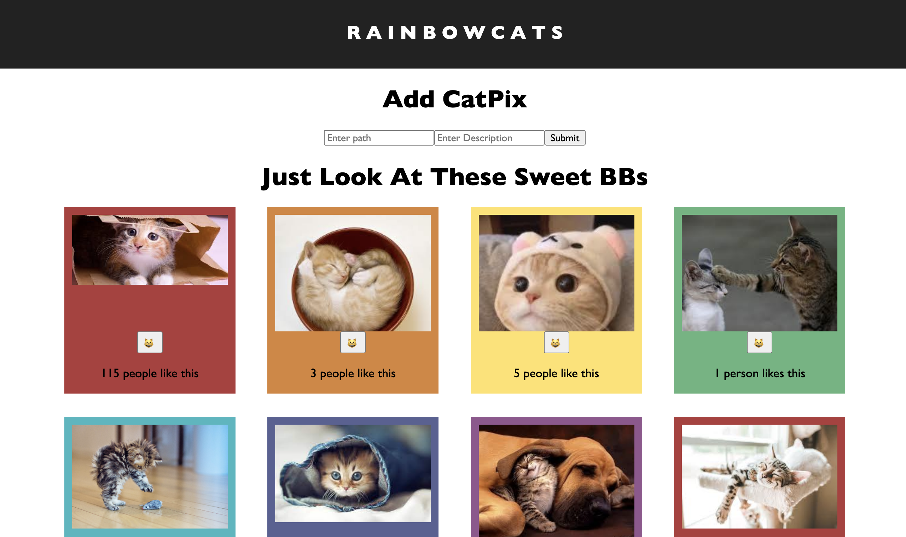

# R A I N B O W C A T S

## Description

*Duraton: 3-day Sprint*

R A I N B O W C A T S  is a photo gallery app that lets you like and add cute photos of cats. Image URL, description data, and number of likes are stored on a database. Changes are displayed on the DOM in simple interface featuring a repeating rainbow of colors and randomized headline. (Note: deleting photos is not availble at this time, but who would want to get rid of a cute cat pic anyway?)

## Screenshot    

## Usage

### Adding a Photo
* Enter the URL of a cat photo, such as https://tinyurl.com/33yrxx3e
* Enter a description (maybe, "a really cute cat"?)
* Click "submit"
  * The photo is POSTed via axios > express > PostgreSQL to the client > server > database and back. 
* The client side, built with React, will update to display all the current cat photos

### Liking a Photo
* Click the smiling cat button below a photo to like it. The emoji changes to a heart-eyed cat to show your love!
  * The total number of likes will increase
  * To simulate the experience of many users liking different photos on  R A I N B O W C A T S, you can either refresh the browser or visit from a different tab, and like again - now the number of likes increases again :)
* If tragedy strikes and you decide you don't like the photo anymore, it's okay. Simply click the heart-eyed cat to change it back to the standard smiling cat, and your like count will be removed.

## Built With

React, Javascript, HTML, CSS, Node, Express, Axios, PostgreSQL

## Next Steps

R A I N B O W C A T S  has room to improve! Here are additional features that may be added in the future:
[ ] Support for removing a photo
[ ] Ability to edit description and URL for a photo
[ ] Additional styling 

## Acknowledgement 

Thanks to [Prime](https://github.com/PrimeAcademy/ "Prime") and our instructor [Dev](https://github.com/devjanaprime/ "Dev") for setting up the parameters of the assignment and providing inspiring stretch goals! Thank you also to my incredible partner Mike for bringing us ice cream while I worked on this project.

